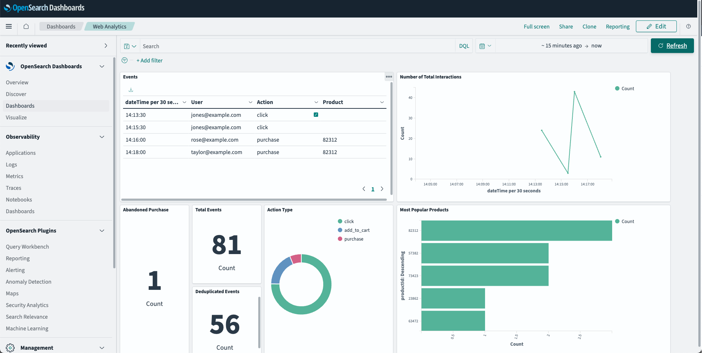

# Real-Time Web Shop Analytics

> *Note: The JWT token for authenticating the requests from your local frontend to Amazon Kinesis expires within 24 hours. As this repository is intended for experimental use only, you may have to re-deploy afterwards.*

## Overview 

The project delivers a code sample to experiment with real-time web analytics with a simplified online shop as web front, Apache Flink application for real-time pattern detection using Amazon Managed Service for Apache Flink, and an OpenSearch Dashboard to visualize the results using Amazon OpenSearch Service. 

This application is capable of ingesting click, add to cart, and purchase event from the online shop including the user that can be specified on the interface. Then the clickstream data is analyzed for predefined patterns such as removing duplicates, add to cart events that are not followed by a purchase event within a specified timeframe etc. The results are then visualized in the OpenSearch Dashboard. 

This repository is intended to get developers started experimenting with analyzing clickstream data on AWS. 

## Architecture Diagram 


The architecture diagram displays two workflows: (1) the ingestion of clickstream data from the local front end into the Amazon OpenSearch cluster and (2) how we gain access to view the Amazon OpenSearch Dashboard using port forwarding through a bastion host. 

(1) The frontend of the application will run locally on your machine with a React/Next.JS stack. Clickstream data is ingested with the following three actions: selecting a product, adding a product to your shopping cart, and purchasing a product. Within this demo you can change between users by using the drop-down menu in the upper right corner. A new session is started every time the page is reloaded. All clickstream data generated on the local frontend will be ingested to Amazon Kinesis. In order to authenticate that only your local frontend is able to write data to Amazon Kinesis, Amazon Cognito is used. The clickstream data is ingested through an VPC endpoint into the Flink Application hosted in Amazon Managed Service for Apache Flink. Within the Apache Flink application the real-time event pattern recognition takes place using the [FlinkCEP](https://nightlies.apache.org/flink/flink-docs-release-1.18/docs/libs/cep/) library for complex event processing is used. The raw clickstream data and the output from multiple event patterns is ingested into the OpenSearch cluster.

(2) In order to view the Amazon OpenSearch Dashboard with the detected event patterns, we use Session Manager a feature of Systems Manager to connect to the Bastion Host within the private subnet of the VPC. Through port forwarding we connect to the OpenSearch cluster and use port forwarding to view the Amazon OpenSearch Dashboard on our localhost. 


## Screenshots

Here is the online shop web front included in the code sample. It is a simplified online shop where click events, add to shopping cart events and purchase events can be created by interacting with the interface. The registered user can be changed using the drop-down menu in the upper right corner. This will also create a new session. You will have to log in once with the provided credentials (see *Getting Started*) to be fully authenticated and authorized to write event data to AWS. 


The created events can be seen when clicking on the *Insights* tab on the left-hand side. Here all events can be reviewed including duplicates of events that are generated by the application to show then later deduplication through the Apache Flink application. 


The OpenSearch Dashboard can be imported following the steps in the *Getting Started* section. It includes an overview of clickstream events and the results of the detected patterns (deduplication and not-purchase-events). 



## Pre-requisites
* [Java 11 or later](https://docs.aws.amazon.com/corretto/latest/corretto-11-ug/downloads-list.html)
* [Apache Maven 3.9.6 or later](https://maven.apache.org/)
* [AWS CLI](https://docs.aws.amazon.com/cli/latest/userguide/getting-started-install.html) 
* [AWS Cloud Development Kit (CDK)](https://aws.amazon.com/cdk/)
* [Node](https://nodejs.org/en/download) (Frontend for this solution is a React web application that can be run locally using Node)
* [npm](https://docs.npmjs.com/downloading-and-installing-node-js-and-npm) (Installation of packages required to run the web application locally)
* [Session Manager Plugin](https://docs.aws.amazon.com/systems-manager/latest/userguide/session-manager-working-with-install-plugin.html) (Session Manager Plugin is required for access to OpenSearch Dashboards using Session Manager)

## Getting Started

1. Clone the repository to your desired workspace:

```bash
git clone ...
```

2. Move to the flink-consumer directory and build the JAR file:

```bash
cd flink-consumer && mvn clean package
```

3. Set your correct email address (*userEmail*) and your desired user name (*userName*) to which the AWS Cognito User Pool invitation is sent:

```bash
open  cdk/bin/cdk.ts 
```

4. Build the resources:

```bash
cd cdk && npm install && cdk deploy
```

5. Take note of the output values. The output will similar to the output below:

```bash
 ✅  WebAnalyticsStack

✨  Deployment time: 1438.07s

Outputs:
WebAnalyticsStack.accessOpenSearchClusterOutput = aws ssm start-session --target i-06176d7f66640aff6 --document-name AWS-StartPortForwardingSessionToRemoteHost --parameters '{"portNumber":["443"],"localPortNumber":["8157"], "host":["vpc-opensearch-web-analytics-yjlawzqqao3tb52askwvkiiubi.<Region>.es.amazonaws.com"]}'
WebAnalyticsStack.bastionHostIdOutput = i-06176d7f66640aff6
WebAnalyticsStack.cognitoClientIdOutput = 72e9a7gpjauid0k7j7doe1frfp
WebAnalyticsStack.cognitoClientSecretOutput = 8pf6bmtfrdk8ttg5jne1d9hj2qa109qg9d85n52ae57g79a1vsv
WebAnalyticsStack.domainEndpointHostOutput = vpc-opensearch-web-analytics-yjlawzqqao3tb52askwvkiiubi.<Region>.es.amazonaws.com
WebAnalyticsStack.identityPoolIdOutput = <Region>:825837df-11ca-43d5-a6a0-a3cfa04897f9
WebAnalyticsStack.regionOutput = <Region>
WebAnalyticsStack.userPoolIdOutput = <Region>_CRyHUtnsh
Stack ARN: 
arn:aws:cloudformation:<Region>:<Account-ID>:stack/WebAnalyticsStack/71a1a2f0-c445-11ee-ac5a-12bb64c986e7

✨  Total time: 1442.5s
```

6. Establish connection to OpenSearch:

_For Mac/Linux:_

Run the following command to establish connection to OpenSearch in a seperate terminal window. The command can be found as output `accessOpenSearchClusterOutput`:

```bash
aws ssm start-session --target <BastionHostId> --document-name AWS-StartPortForwardingSessionToRemoteHost --parameters '{"portNumber":["443"],"localPortNumber":["8157"], "host":["<OpenSearchDomainHost>"]}'
```

_For Windows:_

Open a seperate Windows cmd terminal. 

```Windows cmd
aws ssm start-session ^
    --target <BastionHostId> ^
    --document-name AWS-StartPortForwardingSessionToRemoteHost ^
    --parameters host="<OpenSearchDomainHost>",portNumber="443",localPortNumber="8157"
```


7. Go back to the root folder and create the Elasticsearch indices:

```bash
bash scripts/create_index.sh
```

8. Open the OpenSearch Dashboard: 

- Open your browser and access `https://localhost:8157/_dashboards`.
- Open the menu and click on *Stack Management*


 - Then click on *Saved Objects* and import *export.ndjson* which can be found in the scripts folder

 

9. Generate the streaming data:

- Set up the website:
```bash
cd frontend && npm install 
``` 

- Start up the website and access `localhost:3000` after running:

```bash
npm run dev
``` 

- Login with the provided username and one-time password received per email by clicking *Sign In* in the upper left corner of the screen. Change the password. Start clicking, adding items to cart and making a purchase. You can also change the current user using the select menu. 

## Clean up 

Delete the WebAnalytics Stack in your AWS account.

```bash
cd cdk && cdk destroy
```
Note: You may have to delete the *AWSServiceRoleForAmazonElasticsearchService* separately. 

## Security

See [CONTRIBUTING](CONTRIBUTING.md#security-issue-notifications) for more information.

## License

This library is licensed under the MIT-0 License. See the LICENSE file.

